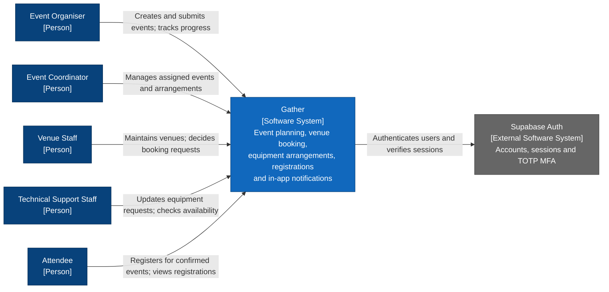
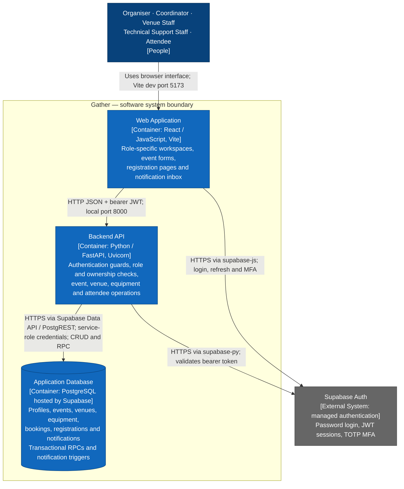
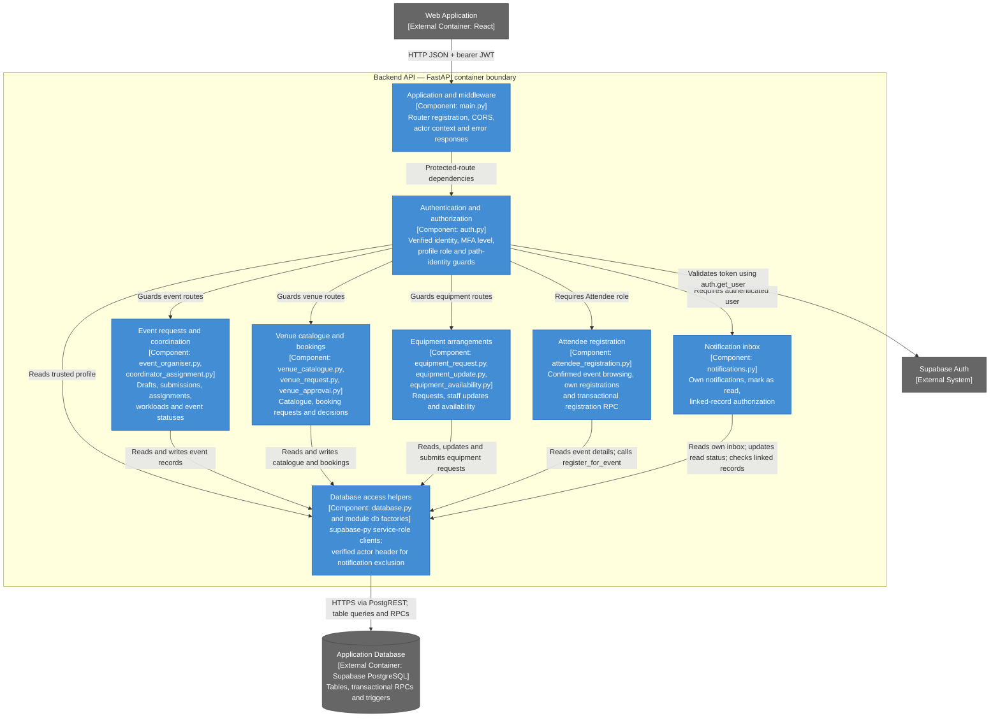

# Gather — C4 architecture

This describes the current repository, including Sprint 2 attendee registration
and in-app notifications. It is a code-based architecture view, not confirmation
that every SQL migration has been applied to the live Supabase project.

The diagrams use Mermaid flowcharts with C4 element types and technology labels.
Arrows show the caller or initiator and name the interaction. Blue elements belong
to Gather; grey elements are external services; dark blue elements are people.
The system boundary is logical ownership: Gather's application database is part
of the system even though Supabase hosts it. Supabase Auth is an external service.

## Level 1 — System Context

Shows who uses Gather and the external identity service it depends on.

All five roles can access their own notification inbox. The coordinator controls
event status, including Confirmed; the attendee registers for an eligible event.

## Level 2 — Containers

Shows the separately running application pieces and how they communicate.
A C4 container is an application or data store; it does not imply Docker.

- **Web Application:** `App.jsx` selects the user's workspace. `AuthContext.jsx`
  handles login, session refresh and MFA; `api.js` attaches the bearer token to
  business-data requests. Role profiles are loaded through the backend.
- **Backend API:** `main.py` wires ten feature routers, CORS, actor context and
  database-error handling. This is one application process, with modular routes.
- **Application Database:** The backend uses Supabase's HTTPS Data API, not a
  direct PostgreSQL socket. The managed Data API is represented on the connection
  rather than as an application container maintained by this repository.
- **Identity:** Account/session data is managed by Supabase Auth. Application
  roles live in `public.users`; browser visibility is not the authorization boundary.
- **Notifications:** PostgreSQL triggers insert recipient-specific rows when
  relevant changes commit. The web inbox polls the API every 30 seconds and also
  supports manual refresh. There is no separate notification worker or message queue.

The ports describe local development. The repo does not establish a production
hosting topology, so this diagram does not invent one. MAMP's directory location
does not make PHP or MySQL part of the application runtime.

## Level 3 — Backend Components

Zooms into the FastAPI container. Related router modules are grouped where they
serve one functional area; these components are not independently deployed services.

The arrows from authorization to features express request dependency order, not
literal Python call direction. Feature routes also enforce record-specific
ownership and assignment checks. Database helpers are spread across existing
modules; `database.py` wraps client creation and forwards the verified actor ID.

## Database responsibilities relevant to Sprint 2

| Responsibility | Implementation |
|---|---|
| Store attendee registrations | `event_registrations`, unique event/attendee pair and saved timestamp |
| Prevent overbooking and duplicate registration | `register_for_event` locks the event row, checks attendee role, confirmed status, start time, duplicate and capacity, then inserts |
| Save equipment request atomically | `submit_equipment_request` saves header and items together |
| Generate notifications | Event and booking triggers call recipient-selection helpers and `emit_notifications` within the write transaction |
| Restrict direct access | New tables have RLS enabled; browser roles have no direct grants to the new tables or write RPCs; backend checks access using verified identity |
| Read notifications | API filters by recipient; linked records undergo fresh authorization; read status persists in `notifications` |

The existing tables referenced by the backend are `users`, `Event Details`,
`Venues`, `Venue Booking Requests`, `Equipment`, `Equipment Request`,
`Equipment Request Item`, `Equipment Reservation`, and `Equipment Reservation Item`.
The SQL files in this repo are incremental migrations, not a full schema export.

## Source map

| Architecture element | Repository sources |
|---|---|
| Role workspaces | [App.jsx](../../frontend/src/App.jsx) |
| Browser authentication and MFA | [AuthContext.jsx](../../frontend/src/AuthContext.jsx), [Supabase client](../../frontend/src/utils/supabase.js), [MfaChallenge.jsx](../../frontend/src/MfaChallenge.jsx), [SecuritySettings.jsx](../../frontend/src/SecuritySettings.jsx) |
| Browser API transport | [api.js](../../frontend/src/api.js) |
| Attendee UI and inbox | [AttendeeWorkspace.jsx](../../frontend/src/AttendeeWorkspace.jsx), [Notifications.jsx](../../frontend/src/Notifications.jsx) |
| API composition and access guards | [main.py](../../backend/main.py), [auth.py](../../backend/auth.py) |
| Event lifecycle | [event_organiser.py](../../backend/event_organiser.py), [coordinator_assignment.py](../../backend/coordinator_assignment.py) |
| Venue operations | [venue_catalogue.py](../../backend/venue_catalogue.py), [venue_request.py](../../backend/venue_request.py), [venue_approval.py](../../backend/venue_approval.py) |
| Equipment operations | [equipment_request.py](../../backend/equipment_request.py), [equipment_update.py](../../backend/equipment_update.py), [equipment_availability.py](../../backend/equipment_availability.py) |
| Attendee and notification APIs | [attendee_registration.py](../../backend/attendee_registration.py), [notifications.py](../../backend/notifications.py) |
| Service-client actor context | [database.py](../../backend/database.py) |
| Registration RPCs and notification triggers | [Sprint 2 migration](../../backend/sql/sprint2_registration_notifications.sql) |

Level 4 code diagrams are omitted: the module-level component view is sufficient
for this application's architecture overview. Individual algorithms can be
documented separately when needed.
