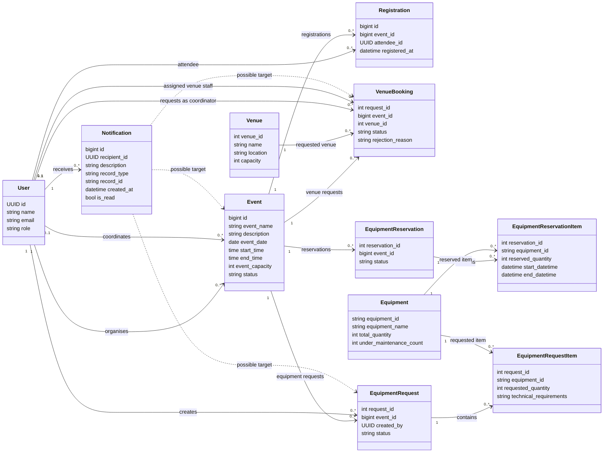

# Gather — domain class diagram

This UML domain view represents records used by the current repository. These
are not existing Python entity classes: the implementation uses route functions,
dictionaries and Pydantic request models. Selected attributes are shown; the
associations stand in for most foreign-key fields to reduce clutter.

## Reading the diagram

- `1` means exactly one; `0..1` means optional; `0..*` means zero or more.
- Roles are values in `User.role`, not separate subclasses: Event Organiser,
  Event Coordinator, Venue Staff, Technical Support Staff and Attendee.
- `Registration` links an attendee to an event. The event/attendee pair is unique.
- A notification has one recipient. Its `record_type` and `record_id` identify
  exactly one event, venue booking or equipment request; dotted arrows show
  alternative logical targets, not three required foreign keys.
- Approved venue bookings provide an event's published venue information.
- Equipment requests and reservations are separate concepts used by the code;
  availability reads reservations. This diagram does not imply a request-to-
  reservation conversion workflow exists.
- Request creation requires equipment items, but the current technical-support
  update path can remove items, so persisted item multiplicity is `0..*`.
- The equipment-request endpoint currently prevents a second request for the
  same event. The diagram shows the general data relationship because no full
  database schema or event/request uniqueness constraint is supplied by the repo.
- Except for the new registration and notification tables, relationships and
  selected types are inferred from query fields and API models, not a complete
  live-schema export.

## Record mapping

| Diagram class | Database table |
|---|---|
| User | users |
| Event | Event Details |
| Registration | event_registrations |
| Notification | notifications |
| Venue | Venues |
| VenueBooking | Venue Booking Requests |
| Equipment | Equipment |
| EquipmentRequest | Equipment Request |
| EquipmentRequestItem | Equipment Request Item |
| EquipmentReservation | Equipment Reservation |
| EquipmentReservationItem | Equipment Reservation Item |

For C4 Level 4, select the classes and actual functions relevant to one component
rather than presenting this whole-system domain model as one microservice's code.
