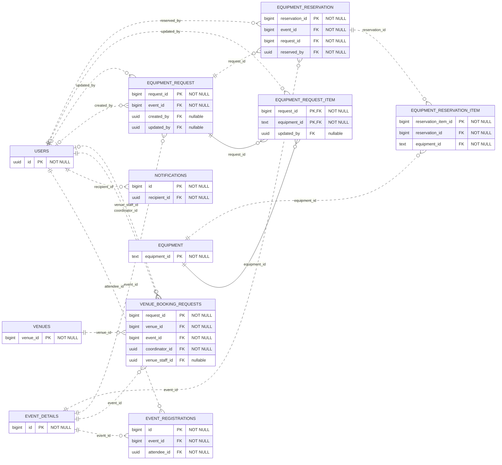
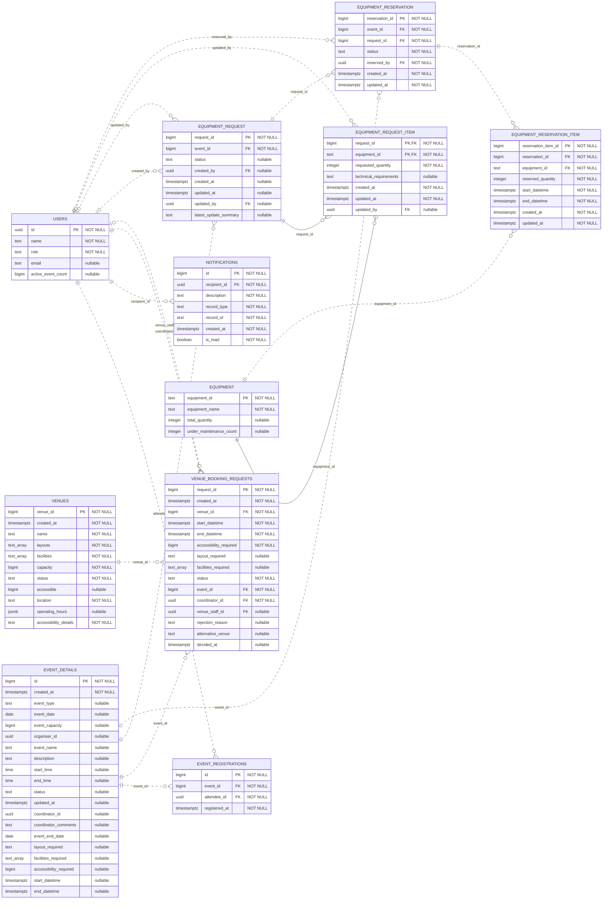

# Gather — live Supabase ER diagram

Read-only schema snapshot: 1 October 2026. Source: the configured project's
Supabase Data API / PostgREST OpenAPI schema, accessed with backend credentials.
No user records, passwords or keys are included in this document or snapshot.

## Scope and notation

- Covers the **11 application tables exposed by the Data API**. Supabase-managed
  schemas such as `auth` and `storage`, unexposed schemas, SQL functions, triggers,
  indexes and policies are outside this API schema export.
- `PK` means primary-key column; `FK` means a declared foreign key reported by
  PostgREST. Two `PK` columns in `EQUIPMENT_REQUEST_ITEM` form one composite key.
- `NOT NULL` / `nullable` comes from the schema's required-column list.
- Parent-side `||` means a required reference; `|o` means an optional reference.
- Child-side `o{` shows a potentially-many collection. The export does not report
  every unique constraint, so narrower upper bounds cannot be independently
  verified here. For example, the app currently blocks a second equipment request
  per event, while that restriction is not expressed in this API schema export.
- Dashed lines use Mermaid's non-identifying relationship notation; they do not
  mean the foreign keys are unverified. Solid lines identify relationships whose
  FK participates in the child primary key. All edges come from reported FKs.
- Table names are normalized to uppercase/underscores for diagram readability;
  exact database names are mapped below. `text_array` represents PostgreSQL `text[]`.

## Overview — keys and relationships

## Complete diagram — all exposed columns

## Relationships used by the application but not reported as foreign keys

These are deliberately omitted from the physical ER diagrams:

| Column | Application-level target | Evidence / limitation |
|---|---|---|
| Event Details.organiser_id | users.id | Backend reads ownership using this UUID; no FK annotation in live API metadata |
| Event Details.coordinator_id | users.id | Backend uses this UUID for assignment; no FK annotation in live API metadata |
| users.id | Supabase Auth user ID | Login/profile lookup uses the same UUID; auth schema is not exposed and no FK annotation is reported |
| notifications.record_id | Event Details.id, Venue Booking Requests.request_id, or Equipment Request.request_id | Target is selected by record_type; this text column is not a declared FK |

The repo's Sprint 2 migration additionally declares a **composite unique
constraint on event_registrations(event_id, attendee_id)**. That rule is supported
by the migration source, but unique-constraint metadata is not exposed by this
schema endpoint. It is not mislabeled as two individually unique columns.

## Table-name mapping

| Diagram name | Actual Supabase table |
|---|---|
| USERS | users |
| EVENT_DETAILS | Event Details |
| EVENT_REGISTRATIONS | event_registrations |
| NOTIFICATIONS | notifications |
| VENUES | Venues |
| VENUE_BOOKING_REQUESTS | Venue Booking Requests |
| EQUIPMENT | Equipment |
| EQUIPMENT_REQUEST | Equipment Request |
| EQUIPMENT_REQUEST_ITEM | Equipment Request Item |
| EQUIPMENT_RESERVATION | Equipment Reservation |
| EQUIPMENT_RESERVATION_ITEM | Equipment Reservation Item |

## Editable artifacts

- [Full Mermaid source](supabase-er.mmd)
- [Keys-only Mermaid source](supabase-er-keys.mmd)
- [Schema metadata snapshot](supabase-schema-snapshot.json)

This live-schema diagram supersedes assumptions in the earlier repo-derived
domain class diagram. In particular, `Equipment Reservation Item` has its own
`reservation_item_id` primary key, and `Equipment Reservation.request_id`
explicitly references `Equipment Request`.
